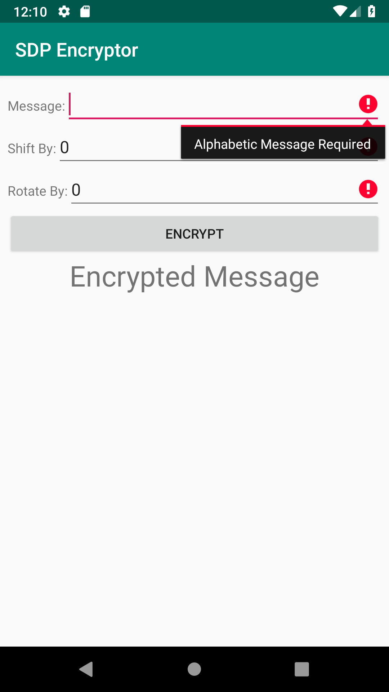
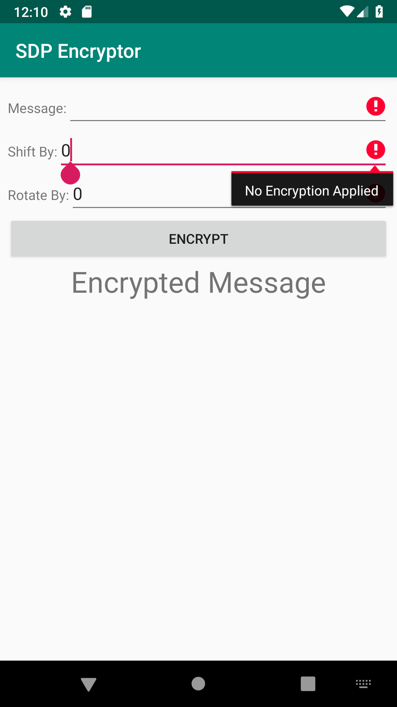
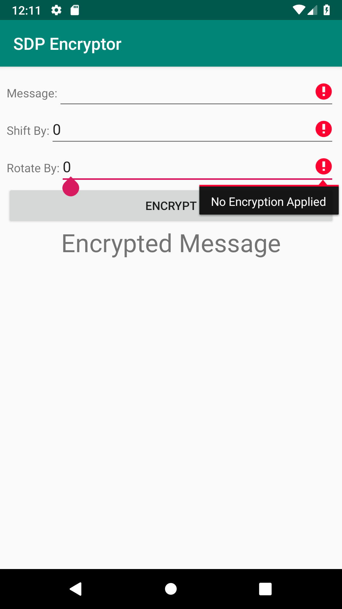
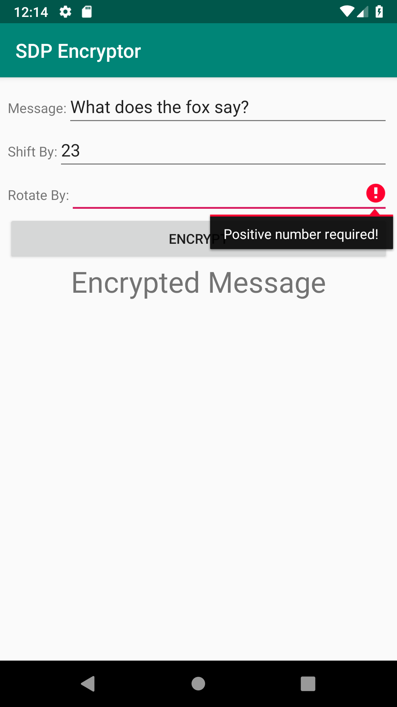

# Encryptor User Manual

## Functionality

An implementation of Cesar Encryption. Input some string that contains at least one alphabetic character, shift number that shift the alphabetic characters alphabetically and rotate number that switch the position of all alphabets in the string backward for that amount.

## I/O

* Input
	* Message to be encrypted
	* Shift number
	* Rotate number
* Output
	* Encrypted message

## Error

## Screenshots

  

  

  

  

