# Encryptor User Manual

## Functionality

An implementation of Cesar Encryption. Input some string that contains at least one alphabetic character, shift number that shift the alphabetic characters alphabetically and rotate number that switch the position of all alphabets in the string backward for that amount.

## I/O

* Input
	* Message to be encrypted
	* Shift number
	* Rotate number
* Output
	* Encrypted message

## Error

1. Alphabetic Message Required
	* happens when the message is empty or contains no alphabets
2. Must Be Between 0 And 25
	* happens then the shift number is negative or larger than 25
3. No Encryption Applied
	* happens when both shift number and rotate number are 0
4. Positive number required!
	* happens when the rotate number is negative
	* a toast appears together with the error

## Screenshots

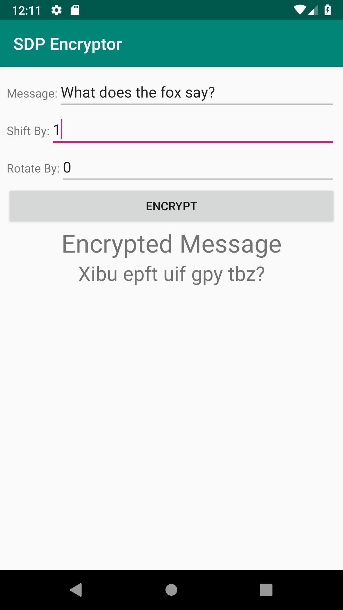 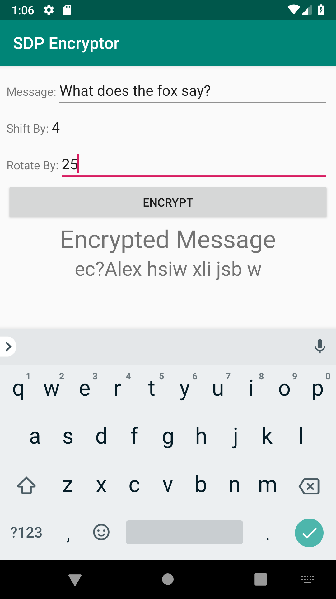 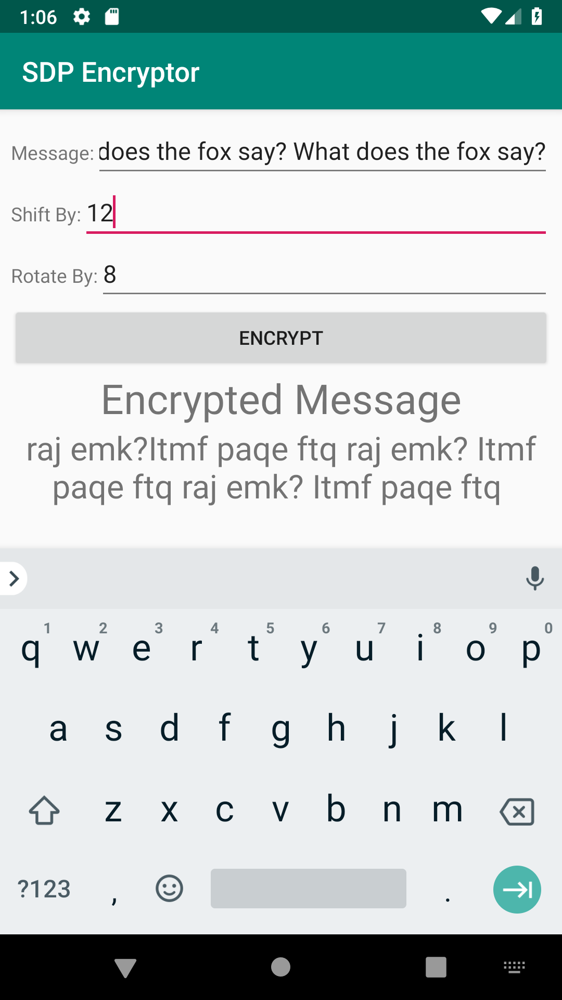 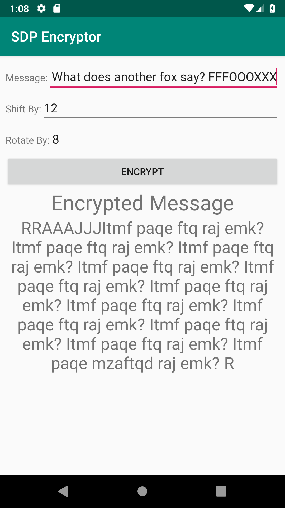

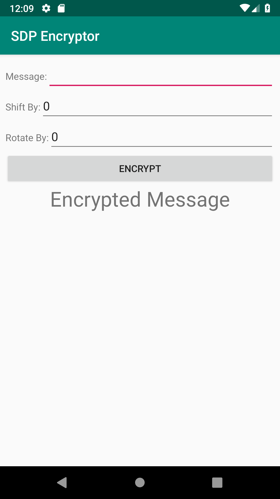 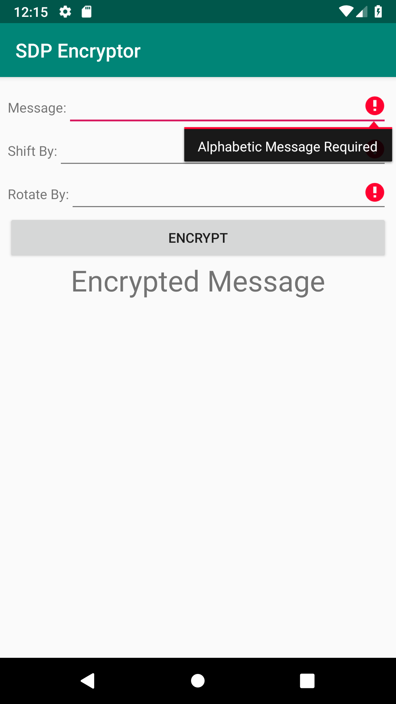 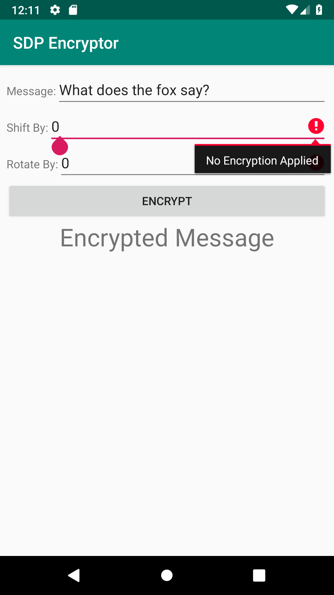 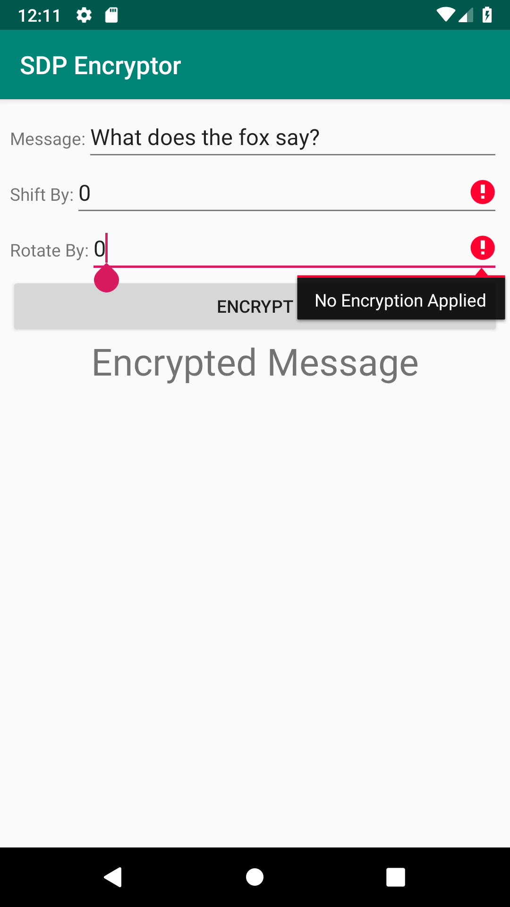

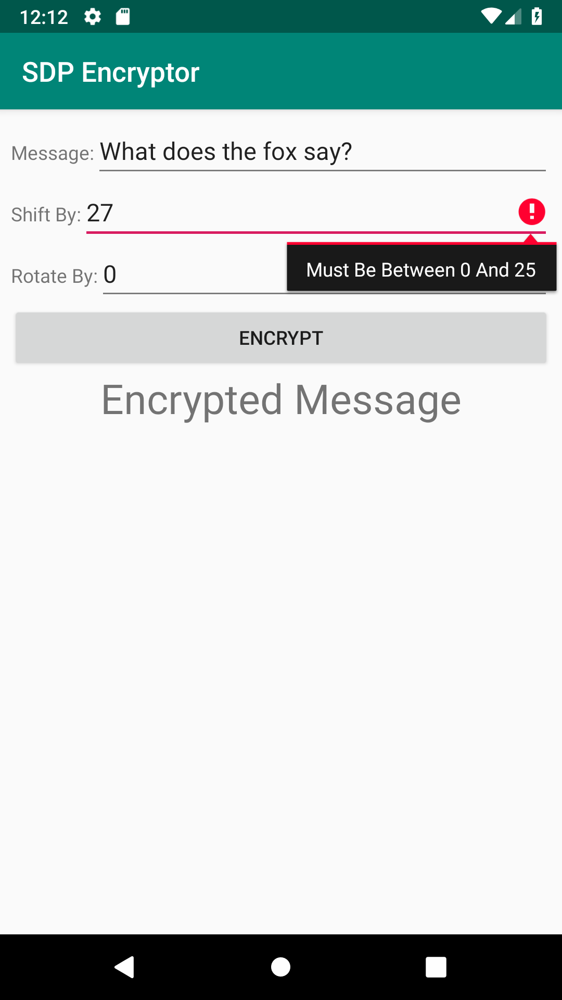  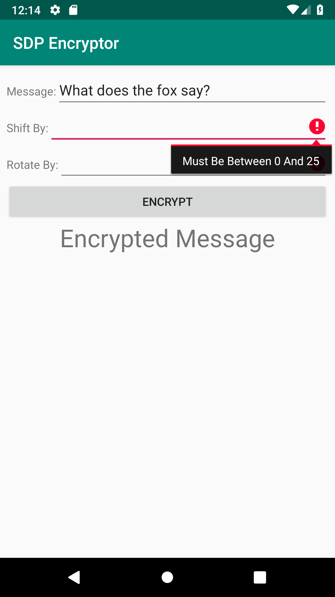 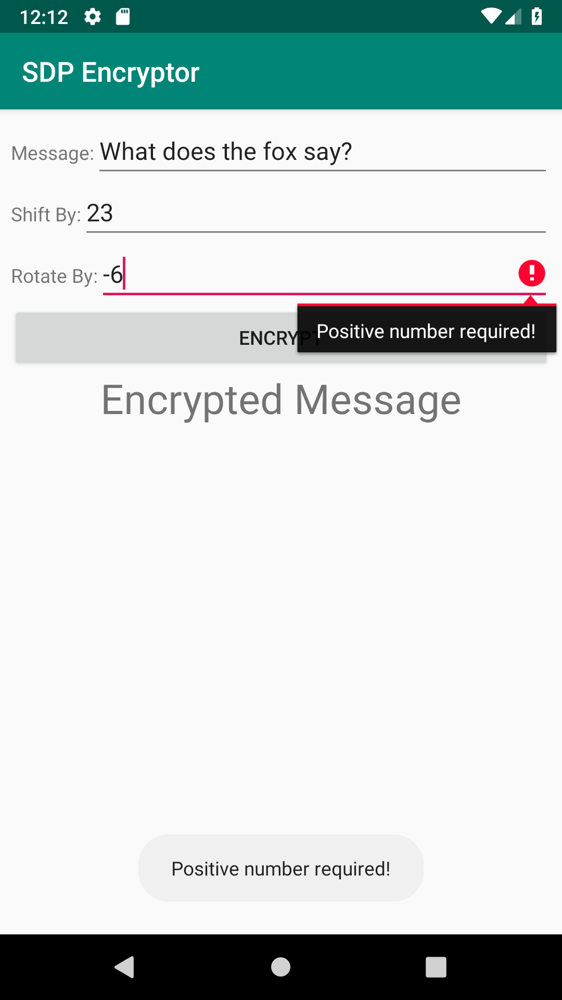